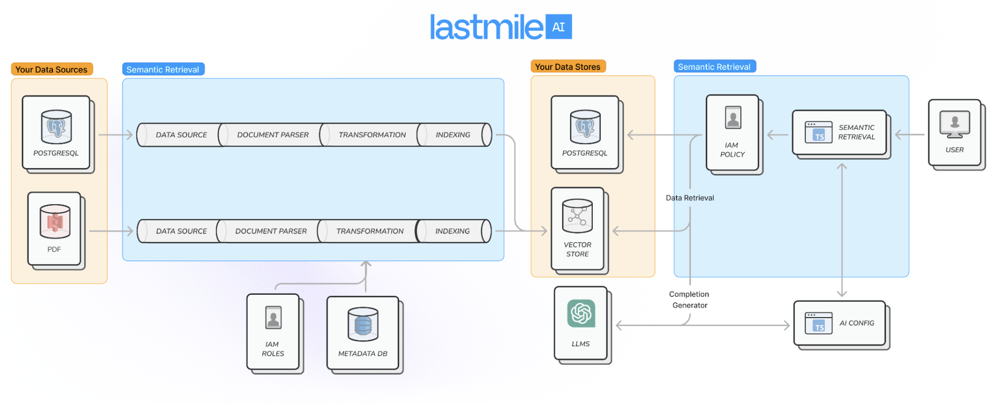
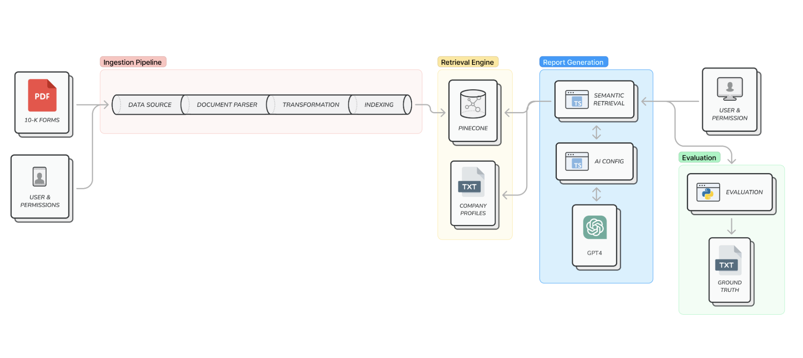
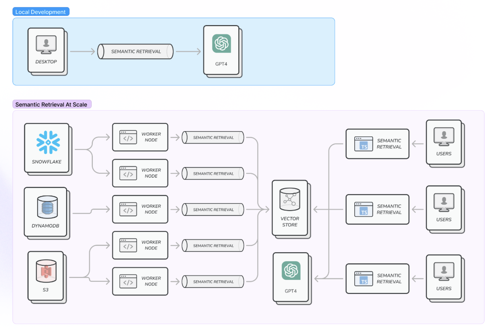

# Semantic Retrieval

**Semantic Retrieval is a framework designed for enterprises to connect data to LLMs in a safe and systematic way.** 

It provides a scalable approach to [Retrieval Augmented Generation](https://ai.meta.com/blog/retrieval-augmented-generation-streamlining-the-creation-of-intelligent-natural-language-processing-models/) (RAG) that works over both structured and unstructured data, and propagates role-based access control (RBAC) that enforce the data's IAM policies during retrieval.

In short, it provides everything an enterprise should need to integrate powerful semantic retrieval flows into their systems:
   - [x] **Data access control**: Define custom RBAC so retrieval respects the access policies of the underlying data.
   - [x] **Custom transformations**: process different types of data in different ways (e.g. tables vs. unstructured text), with fine-tuned embedding models and customizable data connectors.
   - [x] **Hybrid indexes**: Combining lexical, vector, and structured data with a single interface.
   - [x] **Built-in Evaluation**: Define evaluators to measure retrieval quality continuously.
   - [x] **Data refresh**: Re-ingest data as it changes.
   - [x] **Designed for enterprise**: Each part of the service can be self-hosted and self-managed within enterprise cloud boundaries, and scale from one to millions of documents.



> Read more about the broader context of semantic retrieval [here](#context).

# Getting Started

Semantic Retrieval is implemented in both Python and Node.js (TypeScript):
- [Python](#python)
- [Node.js (TypeScript)](#typescript)

Install with your favorite package manager for Node or Python.

### Node.js

#### `npm` or `yarn`

```bash
npm install semantic-retrieval
```

```bash
yarn add semantic-retrieval
```

### Python

#### `pip` or `poetry`

```bash
pip install python-semantic-retrieval
```

```bash
poetry add python-semantic-retrieval
```

## Building your first pipeline
See the [Example](#example) to go over a semantic data pipeline, and get familiar with the interfaces.

# Anatomy of Semantic Retrieval

There are 4 key phases of a semantic data pipeline:
1. **Data ingestion**, transformation and indexing (i.e. ETL)
2. **Data retrieval**
3. **Information synthesis** (i.e. generation)
4. **Result evaluation**

## Example
Suppose you are a private wealth financial advisor, and you want to generate a report for each of your clients about how their portfolio companies have handled the COVID-19 pandemic recovery.

Typically, an advisor would do this manually by looking up the list of portfolio companies for each client, and for each company researching how business has fared after COVID-19.

To enable this with Semantic Retrieval, you would have:

1. **Data ingestion**: Ingest and process unstructured data like 2022 10K's into an index. The text in the 10Ks may be transformed into chunks and indexed as embeddings in a vector database, and the tables in the 10Ks may be saved as SQL tables.

2. **Data retrieval**: Search the index for paragraphs about COVID-19 pandemic recovery.

3. **Information synthesis** (generation): Reword the retrieved data in the form of a report draft for the financial advisor (e.g. using LLMs).

4. **Result evaluation**: Define evaluation functions to measure the quality of the report, and ensure it meets our quality and accuracy bar.



> The semantic-retrieval library has abstractions & concrete implementations for each phase of this process.

## Phase 1 - Data Ingestion, Transformation & Indexing

### Data Ingestion

#### Data Sources
The `DataSource` class provides a way to load data from different sources, such as the local file system, Amazon S3 buckets, or Google Drives. 

The data is represented as a `RawDocument`, which provides a common abstraction for interacting with the data.

#### Document Parsers
Once data is loaded into `RawDocument`s, it must be parsed into a format usable by the other components of the library -- we call these `Document`s. 

The `DocumentParser` class defines how a `RawDocument` is converted to a `Document` for further use. A `Document` is composed of one or more smaller `DocumentFragment`s, which represent a smaller portion of the larger `Document`. 

A `DocumentFragment` should ideally represent some complete context of a portion of the larger `Document`: for example, a PDF's `Document` representation might have each of its pages represented by a `DocumentFragment`.

### Data Transformations
The `Transformer` class serves as a basis for implementing the transformations of `Document`s into intermediate formats like chunks and embeddings.

Although `Document`s may be used directly after they are parsed from a data source, it is often beneficial to first convert them into a format that will benefit the end use case of the data. 

For example, you may have `Transformer`s for: transforming unstructed data to structured data; creating vector embeddings from the data; summarizing or extracting additional information from the data. 

> Best of all, `Transformer`s are composable, so your semantic data pipeline can be a series of `Transformer`s that are chained together.

### Data Indexing
Transformed `Document`s and other data can be stored in various underlying indexes or data stores in order to be retrieved for future use in Phase 2. 

One very common example is the indexing of contextual data as vector embeddings in a vector database, to be retrieved at LLM completion request time in order to augment the prompt context. 

The library supports a number of such data stores and indexes out-of-the-box, with useful abstractions to leverage for additional implementations.

## Phase 2 - Data Retrieval
Retrieving data is handled by the `Retriever`, which has knowledge of the underlying data store/index and its relevant query structure. 

Retrievers aren't just limited to retrieving data from a single underlying data store: they can support any desired custom retrieval logic for more complex use cases (composition of retrievers, heuristics such as staleness, etc.).

> This means you can can a composite `Retriever` that composes other retrivers. For example, you may retrieve a combination of data from a postgres table as well as a vector DB.

## Phase 3 - Information Synthesis (Generators)
`CompletionGenerator` is responsible for information synethesis from a retriever. For example, an `LLMCompletionGenerator` uses a generative AI model (`CompletionModel`) to pass in the retrieved data and generate the final result.

> Generation is the last step in the semantic data pipeline. 

## Access Control
Proper access control is essential for safely leveraging data in semantic retrieval flows. The access control implementation in this framework differs slightly depending on the language used. A future iteration will consolidate both languages to a single implementation.

### Typescript
The typescript library leverages a concept of `ResourceAccessPolicy` to define which identities have access to requested resources. During ingestion, the `ResourceAccessPolicies` for source `RawDocument`s is specified in the associated `DocumentMetadataDB` entries. 
Post-ingestion, any access to an underlying data store is performed with the use of an `AccessPassport`, which is a mapping of all the resources an end-user has access to, to that user's `AccessIdentity` (e.g. authentication credentials) for that resource. When an attempt is made to access data belonging to a particular resource, the relevant `ResourceAccessPolicy` tests the user's `AccessIdentity` to determine their permission for that resource.

During retrieval, a `DocumentRetriever` will test whether the requestor has access to read the documents by calling the `testDocumentReadPermission` to filter out non-readable documents from those returned. For non-document resource accesses, the `testPolicyPermission` function on the associated `ResourceAccessPolicy` can be used to determine which permissions the identity has for the resource.


### Python
The python library leverages a `user_access_function` and `viewer_identity` as part of retrieval. The lowest point of data access calls the `user_access_function` to determine if the `viewer_identity` has permissions to access a particular resource: if a retriever retrieves data directly, the access check is performed in the retriever; otherwise, if the retriever queries data from an underlying data store, the access check is performed by the data store.


#### Changelog
Pypi v0.1.3

This version contains some simple new helper functions for constructing custom config objects from .env and CLI arguments. Also includes README updates applying to both Python and Typescript.

```
changeset:   2a64a87d1890059ceb1d5f21d30f4cb4da9d0bf6
user:        Jonathan Lessinger <jonathan@lastmileai.dev>
date:        Mon, 13 Nov 2023 14:10:09 -0500
summary:     [SR-PY] add config-related helper functions

changeset:   c565aa8aa8aa70cde160ca9b779558423b09f511
user:        Ryan Holinshead <>
date:        Sun, 12 Nov 2023 14:28:59 -0500
summary:     Minor Updates to README: Fill out Access Control section

changeset:   cd438aa90582627f706eb59122da62d5208ddca1
user:        Jonathan Lessinger <jonathan@lastmileai.dev>
date:        Mon, 13 Nov 2023 16:55:14 -0500
summary:     [EZ][SR-PY] one small type fix
```

# A note about scale

Semantic Retrieval pipelines are designed to run on your local machine, and the same implementation can be made to scale up with minimal changes. The data sources, data stores, metadata tracking, and data transformations are all components that can be deployed separately and auto-scaled.

> We are working on a pipeline control plane that makes this even easier. We'd love to work with your team to understand your scale needs and design something with your requirements in mind.



# Roadmap

We are exploring several advanced approaches to optimize performance on top of the foundations of Semantic Retrieval and AIConfig:

1. **SVM retrieval**: Moving beyond kNN by training an SVM to use at query time.

2. **Chain-of-verification retrieval**: Reducing hallucinations with chain-of-verifier retrieval ([paper](https://arxiv.org/abs/2309.11495)).

3. **Fine-tuned embedding models**: Generate higher-quality embeddings by using company-specific data.

4. **Soft prompt tuning**: Moving beyond fixed text prompts for significantly better performance ([paper](https://arxiv.org/pdf/2104.08691v2.pdf)).

5. **Fine-tuned LLM**: Reduce costs by tuning a smaller LLM (e.g. LLaMA2-13B) to perform discrete tasks at GPT4-level accuracy.

> We'd love to work with your team to understand your specific needs, and help build and deploy an optimized pipeline that works for you.

# Appendix

## Context
Despite incredible advances in LLM capabilities, there are still significant limitations to what can be achieved using LLMs on their own. 

Techniques such as retrieval-augmented generation (RAG) have had great success in lifting such limitations and producing high-quality LLM experiences. 

The key to such processes is the integration of external data into the LLM flow. Data can be ingested from a number of different sources, transformed into a format useful for the task at hand, and indexed in alternative data stores for optimal retrieval when it is needed.
